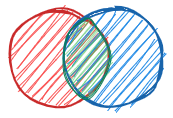
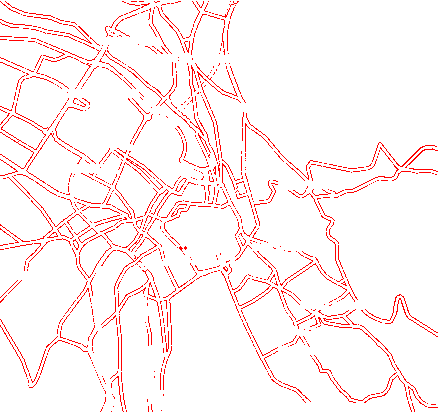

<div align="center">
  <a href="https://github.com/jihchi/dify">
    </a>
  <h1>Dify</h1>
    <p>
      <b>A fast pixel-by-pixel image comparison tool in Rust</b>
    </p>
</div>

[![Workflows - CI][workflows-ci-shield]][workflows-ci-url]
[![crates.io version][crates-io-shield-version]][crates-io-url]
[![crates.io license][crates-io-shield-license]][crates-io-url]
[![crates.io downloads][crates-io-shield-downloads]][crates-io-url]
[![docs.rs][docs-rs]][docs-rs-url]

## Features

| Feature                                                  |     |
| -------------------------------------------------------- | --- |
| `.png`, `.jpg`, `.jpeg`, or `.bmp` format supported      | ✅  |
| Compares different format (`.png` vs `.jpg` for example) | ✅  |
| Compares different dimensions                            | ✅  |
| Anti-aliasing support                                    | ✅  |
| Blockout areas support                                   | ✅  |
| Supports macOS, Linux and Windows                        | ✅  |

## Demo

| expected[^1]                 | actual[^1]                 | diff                        |
| ---------------------------- | -------------------------- | --------------------------- |
|  |  |  |

## Getting Started

### Installation

#### via pre-built binaries

Download the binaries for your platform from [release](https://github.com/jihchi/dify/releases) page.

#### via [cargo](https://doc.rust-lang.org/cargo/getting-started/installation.html)

```sh
cargo install dify
```

#### via Node.js ecosystem

Please refer to [`dify-bin`](https://github.com/jihchi/dify-bin) npm package, it is a node.js wrapper for dify executable file:

```sh
npm install -g dify-bin # or `yarn global add dify-bin`
dify --help
```

## Usage

```sh
dify left.jpg right.jpg
```

Checkout `diff.png` if `a.jpg` and `b.jpg` are different.

For more details, see `dify --help`.

### Docker

```sh
docker run -v $(pwd):/mnt/dify ghcr.io/jihchi/dify left.jpg right.jpg
```

## Benchmarks

Test data comes from [mtrKovalenko/odiff](https://github.com/dmtrKovalenko/odiff/tree/main/images).

```sh
hyperfine \
  --warmup 1 \
  --ignore-failure \
  --export-markdown bench-dify.md \
  'dify tiger.jpg tiger-2.jpg -o tiger-diff.png' \
  'dify water-4k.png water-4k-2.png -o water-diff.png' \
  'dify www.cypress.io.png www.cypress.io-2.png -o www.cypress.io-diff.png'
```

| Command                                                                   |     Mean [ms] | Min [ms] | Max [ms] |     Relative |
| :------------------------------------------------------------------------ | ------------: | -------: | -------: | -----------: |
| `dify tiger.jpg tiger-2.jpg -o tiger-diff.png`                            |    40.2 ± 0.4 |     39.6 |     42.3 |         1.00 |
| `dify water-4k.png water-4k-2.png -o water-diff.png`                      | 1754.9 ± 23.3 |   1716.2 |   1799.6 | 43.68 ± 0.74 |
| `dify www.cypress.io.png www.cypress.io-2.png -o www.cypress.io-diff.png` | 1228.0 ± 17.6 |   1203.6 |   1251.7 | 30.56 ± 0.54 |

Ran on MacBook Pro (13-inch, 2019, Two Thunderbolt 3 ports), macOS Catalina 10.15.7.

## Roadmap

See the [open issues](https://github.com/jihchi/dify/issues) for a list of proposed features (and known issues).

## Contributing

Contributions are what make the open source community such an amazing place to be learn, inspire, and create. Any contributions you make are **greatly appreciated**.

1. Fork the Project
2. Create your Feature Branch (`git checkout -b feature/AmazingFeature`)
3. Commit your Changes (`git commit -m 'Add some AmazingFeature'`)
4. Push to the Branch (`git push origin feature/AmazingFeature`)
5. Open a Pull Request

## License

Distributed under the MIT License. See [`LICENSE`](./LICENSE.md) for more information.

<!-- ACKNOWLEDGEMENTS -->

## Acknowledgements

- This project is inspired by [dmtrKovalenko/odiff](https://github.com/dmtrKovalenko/odiff) and [mapbox/pixelmatch](https://github.com/mapbox/pixelmatch).
- This project implements ideas from the following papers:
  - [Measuring perceived color difference using YIQ NTSC transmission color space in mobile applications](http://www.progmat.uaem.mx:8080/artVol2Num2/Articulo3Vol2Num2.pdf) (2010, Yuriy Kotsarenko, Fernando Ramos)
  - [Anti-aliased pixel and intensity slope detector](https://www.researchgate.net/publication/234126755_Anti-aliased_Pixel_and_Intensity_Slope_Detector) (2009, Vytautas Vyšniauskas)

## Contributors

Many thanks for your help!

<a href="https://github.com/jihchi/dify/graphs/contributors">
  
</a>

The image of contributors is made with [contrib.rocks](https://contrib.rocks).

[workflows-ci-shield]: https://github.com/jihchi/dify/workflows/CI/badge.svg
[workflows-ci-url]: https://github.com/jihchi/dify/actions?query=workflow%3ACI
[crates-io-shield-version]: https://img.shields.io/crates/v/dify
[crates-io-shield-downloads]: https://img.shields.io/crates/d/dify
[crates-io-shield-license]: https://img.shields.io/crates/l/dify
[docs-rs]: https://img.shields.io/docsrs/dify
[crates-io-url]: https://crates.io/crates/dify
[docs-rs-url]: https://docs.rs/dify

[^1]: Images comes from [mapbox/pixelmatch](https://github.com/mapbox/pixelmatch/tree/master/test/fixtures)
